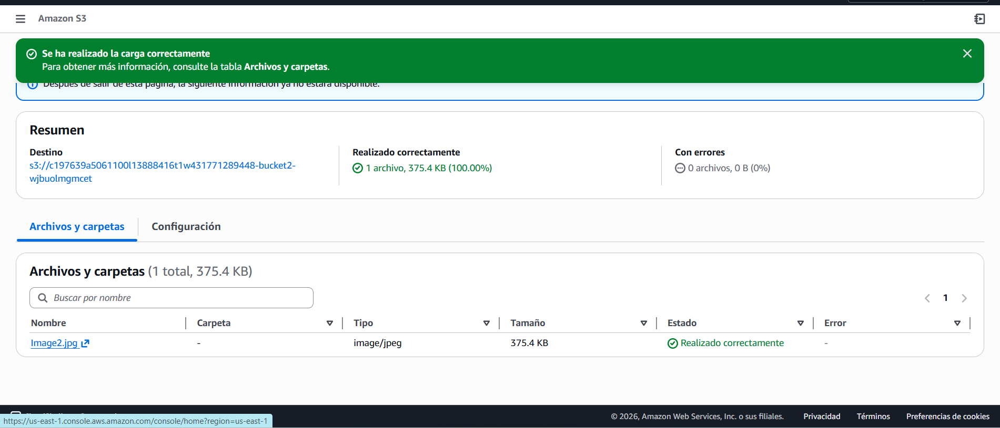

# Análisis de Seguridad - S3 y Roles IAM

## Descripción
Análisis técnico sobre la gestión de accesos en Amazon S3, validando la interacción entre IAM Roles y políticas de bucket para prevenir fugas de datos.

## Escenario
Se requería subir archivos a buckets específicos de S3. El sistema presentaba restricciones basadas en políticas de recursos que bloqueaban el acceso, simulando un entorno de seguridad estricto.

## Objetivos
- Validar la subida de objetos asumiendo roles específicos (IAM Switch Role).
- Identificar y solucionar errores de acceso (403 Access Denied) por políticas restrictivas.

## Herramientas Utilizadas
* **Consola de AWS:** Gestión de S3 e IAM.
* **IAM Roles:** Para la transición de identidades seguras.
* **Markdown:** Para la documentación técnica.

## Acciones Realizadas
* **Identificación de Roles:** Uso del rol `BucketsAccessRole` para el Bucket 2.
* **Análisis de Errores:** Se detectó bloqueo en el Bucket 3 por política JSON.
* **Solución:** Cambio al rol `OtherBucketAccessRole` para completar la carga.

## Evidencia

Carga exitosa en el Bucket 2:

Resolución del desafío en el Bucket 3:

## Resultado
**Conclusión:** Se confirmó que las políticas de bucket tienen prioridad. El acceso fue exitoso tras usar la identidad correcta.

**Calificación Final: 15/15.**

